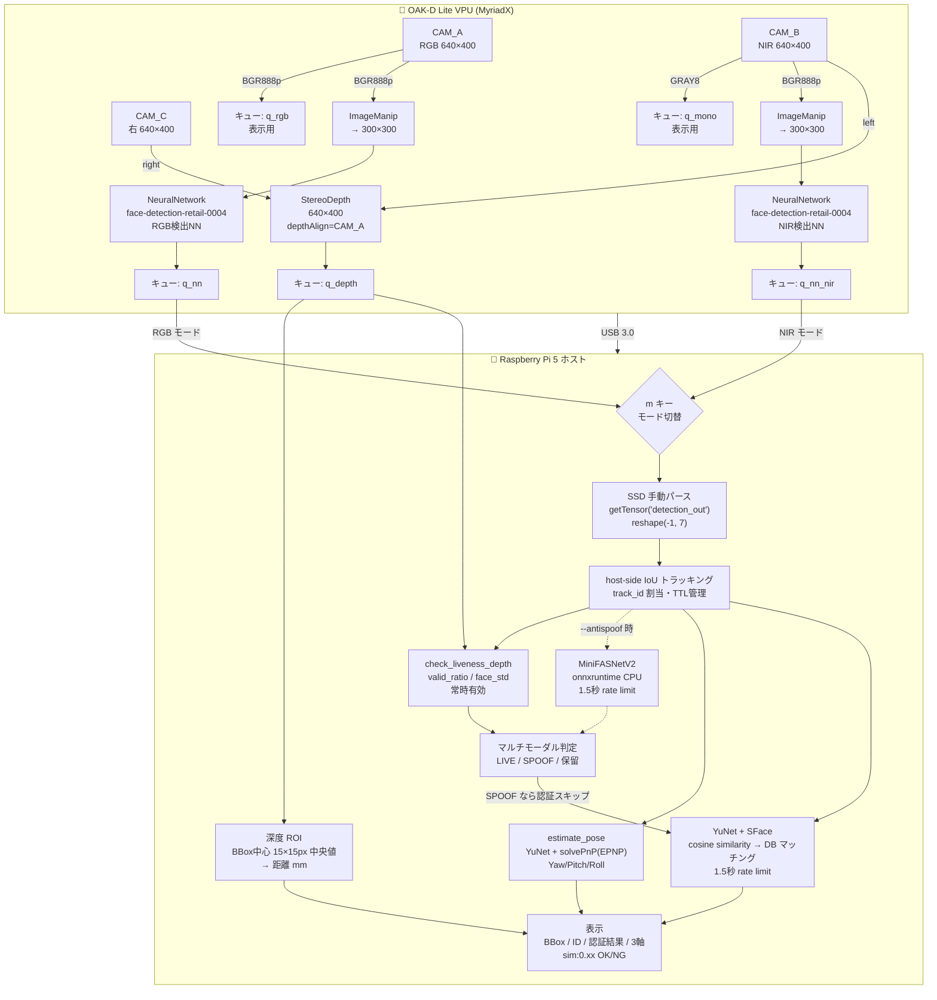
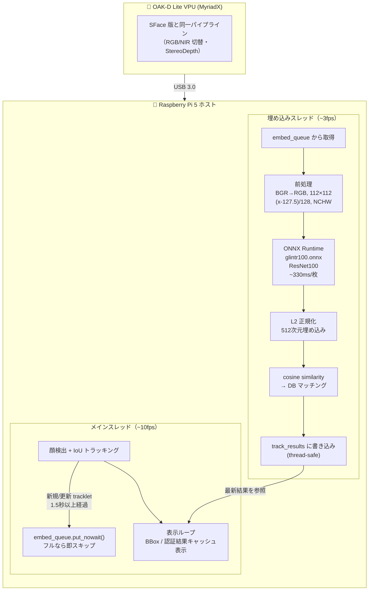

# OAK-D Lite Playground

Raspberry Pi 5 + OAK-D Lite による顔認証・深度計測の実験リポジトリ。

## ハードウェア構成

- Raspberry Pi 5 (8GB)
- OAK-D Lite — USB 3.0（青ポート）に接続

## ソフトウェア環境

| | depthai 2.x（安定版） | depthai 3.x（開発中） |
|---|---|---|
| venv | `venv/` | `venv3/` |
| depthai | 2.27.0 | 3.5.0 |
| 主なスクリプト | `face_recognition_spatial.py` | `face_recognition_spatial_v3.py` / `face_recognition_auraface.py` |
| 状態 | ✅ 安定動作 | 🔧 動作確認済み・継続改善中 |

> **注意**: depthai 3.x は 2.x と API が大幅に異なるため、venv を分けて管理しています。

## セットアップ

### 1. USB 権限

```bash
echo 'SUBSYSTEM=="usb", ATTRS{idVendor}=="03e7", MODE="0666"' | sudo tee /etc/udev/rules.d/80-movidius.rules
sudo udevadm control --reload-rules && sudo udevadm trigger
```

### 2. Pi 5 の USB 電力制限を解除

`/boot/firmware/config.txt` の `[all]` セクションに追記して再起動：

```
usb_max_current_enable=1
```

### 3. 仮想環境と依存パッケージ

```bash
# depthai 2.x（安定版）
python3 -m venv venv
source venv/bin/activate
pip install depthai==2.27.0 opencv-python Pillow blobconverter

# depthai 3.x（開発中）
python3 -m venv venv3
source venv3/bin/activate
pip install depthai opencv-python Pillow blobconverter onnxruntime huggingface_hub
```

### 4. モデルのダウンロード

```bash
# SFace（顔認証 - Apache 2.0）
curl -L 'https://github.com/opencv/opencv_zoo/raw/main/models/face_recognition_sface/face_recognition_sface_2021dec.onnx' \
  -o face_recognition_sface.onnx

# YuNet（顔アライメント用 - MIT）
curl -L 'https://github.com/opencv/opencv_zoo/raw/main/models/face_detection_yunet/face_detection_yunet_2023mar.onnx' \
  -o face_detection_yunet_2023mar.onnx

# AuraFace（顔認証 - Apache 2.0）
python3 -c "
from huggingface_hub import hf_hub_download
hf_hub_download(repo_id='fal/AuraFace-v1', filename='glintr100.onnx', local_dir='.')
"

# MiniFASNetV2（liveness detection / anti-spoof - MIT）
# リポジトリに同梱済み（anti_spoof_mn3.onnx）
# 自前でビルドする場合:
# pip install torch --index-url https://download.pytorch.org/whl/cpu
# python3 scripts/convert_antispoof.py
```

---

## スクリプト一覧

| スクリプト | venv | 説明 |
|---|---|---|
| `check_device.py` | venv | デバイス接続確認（カメラ一覧表示） |
| `capture.py` | venv | RGB + Depth のスナップショットを `/tmp/` に保存 |
| `live_view.py` | venv | RGB + Depth のリアルタイム表示 |
| `live_rgb.py` | venv | RGB のみのリアルタイム表示 |
| `face_recognition.py` | venv | 顔認証（手動深度取得版、depthai 2.x） |
| `face_recognition_spatial.py` | venv | 顔認証（depthai 2.x・**安定版**） |
| `face_recognition_spatial_v3.py` | venv3 | 顔認証 SFace + liveness detection（depthai 3.x 対応版、RGB/NIR 切替、ヘッドポーズ推定） |
| `face_recognition_auraface.py` | venv3 | 顔認証 AuraFace（高精度・Apache 2.0） |

---

## パイプライン構成

### face_recognition_spatial_v3.py（SFace）



### face_recognition_auraface.py（AuraFace）

VPU パイプラインは SFace 版と同一。ホスト側の推論部分が異なる：



### SFace vs AuraFace

| | SFace | AuraFace |
|---|---|---|
| モデル | SFace (ONNX) | GlintR100 / ResNet100 (ONNX) |
| モデルサイズ | 37MB | 261MB |
| 推論時間 (Pi 5 CPU) | ~20ms | ~330ms |
| 埋め込み次元 | 128 | 512 |
| ライセンス | Apache 2.0 | Apache 2.0 |
| デフォルト閾値 | sim > 0.65 | sim > 0.65 |

---

## 顔認証の使い方

```bash
# SFace (depthai 3.x) — 深度 liveness のみ
source venv3/bin/activate
DISPLAY=:0 python3 face_recognition_spatial_v3.py

# MiniFASNetV2 も使うマルチモーダル liveness
DISPLAY=:0 python3 face_recognition_spatial_v3.py --antispoof

# AuraFace (depthai 3.x)
source venv3/bin/activate
DISPLAY=:0 python3 face_recognition_auraface.py

# SFace (depthai 2.x 安定版)
source venv/bin/activate
DISPLAY=:0 python3 face_recognition_spatial.py
```

| キー | 動作 |
|---|---|
| `r` | 顔を登録（名前を入力） |
| `m` | RGB ↔ NIR モード切り替え（検出 NN も切替） |
| `q` | 終了 |

```bash
# 登録データをリセット
rm face_db.pkl          # SFace用
rm face_db_auraface.pkl # AuraFace用
```

---

## Liveness Detection（アンチスプーフィング）

2チャンネルによるマルチモーダル liveness detection。デフォルトは深度のみ、`--antispoof` で MiniFASNetV2 も有効化。

### 深度チャンネル（常時有効）

以下の順番で判定：

1. `valid_ratio < 30%` → **SPOOF**（有効深度ピクセルが少ない＝反射面・スマホ画面）
2. `face_depth < 400mm` → **SPOOF**（カメラに近すぎ・ステレオ信頼性低）
3. `face_std` が 15〜100mm の範囲外 → **SPOOF**（平面 or 背景ノイズ混入）
4. 上記すべて通過 → **LIVE**

実測値（カメラから 90cm）：

| | face_std | valid_ratio |
|---|---|---|
| 実顔 | 27〜33mm | 70〜90% |
| スマホ画面 | 0.6〜1.4mm | 5〜15% |

### RGB チャンネル（`--antispoof` 時のみ）

MiniFASNetV2（ONNX）をホスト CPU（onnxruntime）で推論。real 確率 > 0.5 で LIVE。1.5秒 rate limit。

### 判定ロジック

- `--antispoof` あり：nn=LIVE AND depth=LIVE → LIVE（両方一致必須）
- `--antispoof` なし：depth 判定のみ
- BBox 色：緑=LIVE / 赤=SPOOF / 黄=判定保留

### 注意事項

- NIR モードでも depth チェックは常に RGB（CAM_A）座標の BBox を使用（depth は CAM_A align のため）
- 背景が白壁・黒髪など無テクスチャ面の場合、valid_ratio が低くなる場合あり

---

## ヘッドポーズ推定

- YuNet 5点ランドマーク → solvePnP(EPNP) → Yaw/Pitch/Roll
- 顔に3軸描画（X=赤, Y=緑, Z=青）、BBox 下に角度表示
- キャッシュ更新は毎フレーム（~10fps）

---

## チューニングパラメータ

```python
# 認証
MIN_FACE_WIDTH       = 40     # 認証する最小顔幅 (px) ← 40で約2m前後まで対応
SIMILARITY_THRESHOLD = 0.65   # 同一人物判定ライン (0〜1、高いほど厳しい)
EMBED_INTERVAL       = 1.5    # SFace/AuraFace: 同一顔の再推論間隔 (秒)

# Liveness Detection（深度チャンネル）
LIVENESS_VALID_RATIO = 0.3    # 有効深度ピクセル比率の下限
LIVENESS_MIN_DEPTH_MM= 400    # face_depth 最小値: これ未満は SPOOF
LIVENESS_STD_MIN     = 15.0   # face_std 下限: 平面判定閾値 (mm)
LIVENESS_STD_MAX     = 100.0  # face_std 上限: 背景ノイズ除外閾値 (mm)
DEPTH_BORDER_PX      = 30     # 背景 ROI: BBox 外周何 px か

# 深度マップ表示
DEPTH_MIN_MM         = 200    # 深度マップ表示の最小距離 (mm)
DEPTH_MAX_MM         = 5000   # 深度マップ表示の最大距離 (mm)
```

## 既知の制限・注意事項

- **depthai 3.x**: `SpatialDetectionNetwork` / `ObjectTracker` が OAK-D Lite で動作不安定 → ホスト側で代替実装
- **depthai 2.27.0 を推奨**: 3.x は ISP firmware クラッシュの回避策として Camera ノードを使用
- **NIR 登録推奨**: NIR モードで登録すると昼夜どちらでも認識精度が高い
- **OAK-D Lite は IR カメラ非搭載**: NIR は 940nm 外部照明 + モノカメラで代替
- **ステレオ深度と無テクスチャ面**: OAK-D Lite のステレオ深度は白壁・黒髪など無テクスチャ面のマッチングが失敗する（深度ウィンドウで黒く表示）
- **setExtendedDisparity と setSubpixel は排他**: Subpixel を優先して使用
- **MinZ は 400P 相当で約 40cm**: これより近い対象はステレオ深度が取れない

## モデル・ライセンス

| モデル | ライセンス | 商用利用 |
|---|---|---|
| face-detection-retail-0004 (Intel) | Apache 2.0 | ✅ |
| SFace | Apache 2.0 | ✅ |
| YuNet | MIT | ✅ |
| AuraFace (glintr100) | Apache 2.0 | ✅ |
| MiniFASNetV2 (anti-spoof) | MIT | ✅ |
